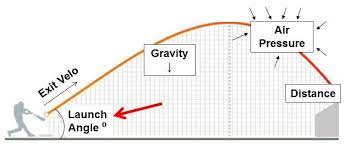
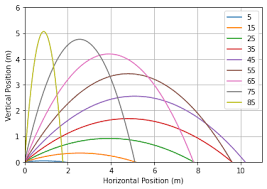
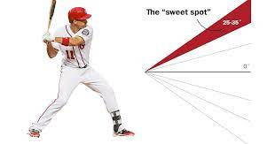
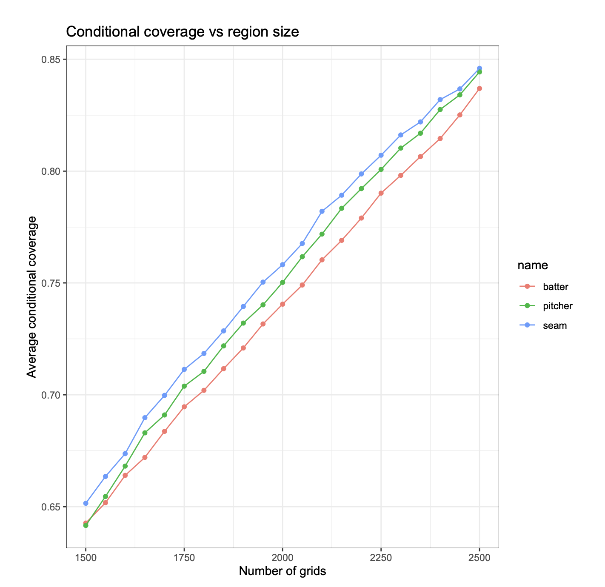

\newcommand{\R}{\mathbb{R}}
\newcommand{\Prob}{\mathbb{P}}
\newcommand{\Proj}{\textbf{P}}
\newcommand{\Hcal}{\mathcal{H}}
\newcommand{\rootn}{\sqrt{n}}
\newcommand{\p}{\mathbf{p}}
\newcommand{\E}{\text{E}}
\newcommand{\Var}{\text{Var}}
\newcommand{\Cov}{\text{Cov}}
\newcommand{\mubf}{\bm{\mu}}
\newcommand{\logit}{\text{logit}}

\newtheorem{cor}{Corollary}
\newtheorem{lem}{Lemma}
\newtheorem{thm}{Theorem}
\newtheorem{defn}{Definition}
\newtheorem{prop}{Proposition}


```{r setup, include=FALSE, warning=FALSE, message=FALSE}
knitr::opts_chunk$set(echo = TRUE,tidy.opts=list(width.cutoff=40))
library(ggplot2)

mycols     = c("chartreuse3", "orangered", "deepskyblue3", "darkorchid1", "yellow")
dark_theme = theme(plot.background   = element_blank(), 
                   panel.background  = element_blank(),
                   #legend.background = element_blank(), legend.key = element_blank(),
                   axis.title.x      = element_text(size = 26, colour = "grey80",
                                                    margin=margin(10,0,0,0)),
                   axis.title.y      = element_text(size = 26, colour = "grey80",
                                                    margin=margin(0,20,0,0)),
                   axis.text         = element_text(size=18, color = "grey80"), 
                   text              = element_text(size=20),
                   axis.title        = element_text(size = 26),
                   legend.title      = element_text(size = 26, colour = "grey80"),
                   panel.border      = element_blank(),
                   panel.grid.major  = element_line(colour = "grey50"), 
                   panel.grid.minor  = element_line(colour = "grey30"))
```


## Last time

- Overdispersion
- Gala data analysis
- Negative Binomial regression
- Zero Inflated Count Models 


## Learning Objectives Today

- Multinomial regression via baseline-category logistic model
- Data analysis


\vspace{12pt}
This slide deck will be a little bit different. It will only contain the data analysis. The lecture will be largely on the blackboard. 


## Baseball example 

In the game of baseball it is important to understand how the characteristics of a player's swing translate to positive outcomes on the baseball field. We want to estimate the probabilities of different baseball outcomes given quality of swing and hitting tendency variables (obtained by STATCAST). 

\vspace{12pt}
The outcomes of interest are: 

- single (1 base)
- double (2 bases) 
- triple (3 bases)
- home runs (4 bases) 
- and outs (0 bases; taken as baseline) 


## 


##

The more bases the better, 4 bases = 1 run. 

\vspace{12pt}
The team with the most runs wins the game. An out (0 bases) is a bad outcome for a batter, an out means the batter ended their time at the plate without reaching base. 

\vspace{12pt}
We want to estimate the probabilities of singles, doubles, triples, home runs, and outs as a function of swing and batting tendency variables are: 

- exit velocity (launch speed off the bat) 
- launch angle (angle off the bat into the air) 
- spray angle (where on the field the ball is going)


##




## 

We will use the baseline-category logistic model for this example. We encoded events so that outs is the baseline category.

\vspace{12pt}
We will build models using AIC, LRT, and domain knowledge.


## 

We now load in the relevant software and data set and display the first 10 rows of the data set

\vspace{12pt}
\tiny
```{r, message=FALSE, warning=FALSE}
library(VGAM)  # has model-fitting functions
bball <- read.csv("bball.csv")
bball$events <- as.factor(bball$events)
dim(bball)
head(bball, 10)
```


## 

We will fit two baseline category logistic models (nested) using a \texttt{vglm} from the \texttt{VGAM} package. 

\vspace{12pt}
One of these models contains a square term for launch angle, why?


## 




## 




##

The model with a quadratic term for launch angle fits the data better.

\vspace{12pt}
\tiny
```{r sabr1, cache = TRUE, warning = FALSE}
mod1 <- vglm(events ~ launch_speed + launch_angle + spray_angle, 
             family=multinomial, data=bball)
system.time(mod2 <- vglm(events ~ launch_speed + launch_angle + spray_angle + 
               I(launch_angle^2), 
             family=multinomial, data=bball))
AIC(mod2) 
AIC(mod1)

pchisq(deviance(mod2), df.residual(mod2), lower = FALSE)
```


##

Model fitting is slow. Let's try scaling the predictors. Scaling does not change the model but it may speed up the optimization.   

\vspace{12pt}
\tiny
```{r sabr1_scale, cache = TRUE, warning = FALSE}
bball_scale <- bball
bball_scale[, 4:6] <- scale(bball[, 4:6])

system.time(mod2_scale <- vglm(events ~ launch_speed + launch_angle + 
    spray_angle +  I(launch_angle^2), 
    family=multinomial, data=bball_scale))

round(AIC(mod2), 4) == round(AIC(mod2_scale), 4)
```


## 

What type of polynomial should we consider for spray angle?


## 


##

How about a 6th order polynomial?

\vspace{12pt}
\tiny
```{r sabr2, cache = TRUE, warning = FALSE}
system.time(mod3 <- vglm(events ~ launch_speed + launch_angle + spray_angle + 
               I(launch_angle^2) + I(spray_angle^2) + I(spray_angle^3) + 
               I(spray_angle^4) + I(spray_angle^5) + I(spray_angle^6),
             family=multinomial, data=bball))

system.time(mod3_scale <- vglm(events ~ launch_speed + launch_angle + spray_angle + 
               I(launch_angle^2) + I(spray_angle^2) + I(spray_angle^3) + 
               I(spray_angle^4) + I(spray_angle^5) + I(spray_angle^6), 
             family=multinomial, data=bball_scale))
```

\vspace{12pt}
\normalsize
Scaling the predictors did not dramatically improve computational time. 


## 

Our 6th order polynomial model for spray angle fits the data better than the model with a single linear term.

\vspace{12pt}
\tiny
```{r}
AIC(mod3); AIC(mod2)
pchisq(deviance(mod3), df.residual(mod3), lower = FALSE)
```


\vspace{12pt}
\normalsize
We could try larger polynomial models, but numerical precision becomes problematic. Scaling did not alleviate this issue.


## 

We now consider some interaction terms.

\vspace{12pt}
\tiny
```{r sabr3, cache = TRUE, warning = FALSE}
system.time(mod4 <- vglm(events ~ launch_speed + launch_angle + spray_angle + 
               I(launch_angle^2) + 
               I(spray_angle^2) + I(spray_angle^3) + I(spray_angle^4) + 
               I(spray_angle^5) + I(spray_angle^6) + 
               I(spray_angle*launch_angle) + I(spray_angle*launch_speed) + 
               I(launch_angle*launch_speed), 
             family=multinomial, data=bball))

AIC(mod3); AIC(mod4)
pchisq(deviance(mod4), df.residual(mod4), lower = FALSE)
```


## 

Let's now examine what we can do with this flexible final model. 

\vspace{12pt}
We plot the $\log\left(\frac{\hat\pi_j(x)}{\hat\pi_J(x)}\right)$ as a function of spray angle for each hit outcome where $J$ corresponds to an out. 

\vspace{12pt}
We will set launch angle and exit velocity to their median values.


\vspace{12pt}
\tiny
```{r}
summary(bball$launch_angle)
summary(bball$launch_speed)

## obtain predictions
new_data = data.frame(spray_angle = seq(-55,55, by = 0.1), 
           launch_speed = 90.30, 
           launch_angle = 12)
pred <- predict(mod4, newdata = new_data)
head(pred, 3)

pred2 <- predict(mod4, newdata = new_data, tyoe = "response")
```


## 


```{r, echo = FALSE}
par(mfrow = c(2,2), oma = c(4,4,0,0), mar = c(1,2,1,1))
plot.new()
title("single")
plot.window(xlim = c(-55,55), ylim = c(min(pred[, 1]), max(pred[, 1])))
points(new_data$spray_angle, pred[, 1], pch = 19, col = rgb(0,0,0,alpha=0.2))
axis(2)

plot.new()
title("double")
plot.window(xlim = c(-55,55), ylim = c(min(pred[, 2]), max(pred[, 2])))
points(new_data$spray_angle, pred[, 2], pch = 19, col = rgb(0,0,0,alpha=0.2))
axis(2)

plot.new()
title("triple")
plot.window(xlim = c(-55,55), ylim = c(min(pred[, 3]), max(pred[, 3])))
points(new_data$spray_angle, pred[, 3], pch = 19, col = rgb(0,0,0,alpha=0.2))
axis(1)
axis(2)

plot.new()
title("home run")
plot.window(xlim = c(-55,55), ylim = c(min(pred[, 4]), max(pred[, 4])))
points(new_data$spray_angle, pred[, 4], pch = 19, col = rgb(0,0,0,alpha=0.2))
axis(1)
axis(2)
```


##

Let's consider these predicted values at a new combination of launch angle and exit velocity.

\vspace{12pt}
\tiny
```{r}
## obtain predictions
new_data = data.frame(spray_angle = seq(-55,55, by = 0.1), 
           launch_speed = 100, 
           launch_angle = 20)
pred <- predict(mod4, newdata = new_data)
head(pred, 3)
```


##

```{r, echo = FALSE}
par(mfrow = c(2,2), oma = c(4,4,0,0), mar = c(1,2,1,1))
plot.new()
title("single")
plot.window(xlim = c(-55,55), ylim = c(min(pred[, 1]), max(pred[, 1])))
points(new_data$spray_angle, pred[, 1], pch = 19, col = rgb(0,0,0,alpha=0.2))
axis(2)

plot.new()
title("double")
plot.window(xlim = c(-55,55), ylim = c(min(pred[, 2]), max(pred[, 2])))
points(new_data$spray_angle, pred[, 2], pch = 19, col = rgb(0,0,0,alpha=0.2))
axis(2)

plot.new()
title("triple")
plot.window(xlim = c(-55,55), ylim = c(min(pred[, 3]), max(pred[, 3])))
points(new_data$spray_angle, pred[, 3], pch = 19, col = rgb(0,0,0,alpha=0.2))
axis(1)
axis(2)

plot.new()
title("home run")
plot.window(xlim = c(-55,55), ylim = c(min(pred[, 4]), max(pred[, 4])))
points(new_data$spray_angle, pred[, 4], pch = 19, col = rgb(0,0,0,alpha=0.2))
axis(1)
axis(2)
```


<!-- ## -->

<!-- ```{r} -->
<!-- dat <- cbind(bball, fitted(mod4)) -->
<!-- HR <- dat %>% filter(b4 > 0.50) -->
<!-- ggplot(HR, aes(x = launch_speed, y = launch_angle)) + -->
<!--   geom_point() + -->
<!--   theme_minimal() -->
<!-- ``` -->


<!-- ## -->

<!-- ```{r} -->
<!-- dat <- cbind(bball, fitted(mod4)) -->
<!-- B2 <- dat %>% filter(b2 > 0.50) -->
<!-- ggplot(B2, aes(x = spray_angle, y = launch_speed)) + -->
<!--   geom_point() + theme_minimal() -->

<!-- ggplot(B2, aes(x = spray_angle, y = launch_speed)) + -->
<!--   geom_point() + -->
<!--   theme_minimal() -->
<!-- ``` -->


## Going deeper: SEAM methodology

We have developed a tool for estimating batted-ball distributions for individual batter-pitcher matchups. SEAM is shorthand for Synthetic Estimated Average Matchup. Here is the app:

\vspace{12pt}
https://seam.stat.illinois.edu/

\vspace{12pt}
Authors: 

- Julia Wapner (currently at Baltimore Orioles)
- Charles Young (currently at Houston Astros)
- David Dalpiaz
- Daniel J Eck


## What is SEAM?

SEAM posits a nonparametric regression model between 2-dimensional batted-ball coordinates and the same STATCAST variables that we considered in this lecture.

\vspace{12pt}
Matchup data is sparse. So we borrow data from "similar" matchups to help estimate the batted-ball distribution under study.

\vspace{12pt}
Some methodology choices are subjective. However, SEAM performs well.

\vspace{12pt}
For more details, see here: https://github.com/ecklab/seam-manuscript/blob/main/seam.pdf


## Why SEAM? 




