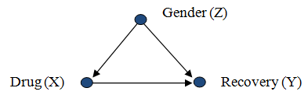

\allowdisplaybreaks

\newcommand{\R}{\mathbb{R}}
\newcommand{\Prob}{\mathbb{P}}
\newcommand{\Proj}{\textbf{P}}
\newcommand{\E}{\mathrm{E}}
\newcommand{\Var}{\mathrm{Var}}
\newcommand{\Hcal}{\mathcal{H}}
\newcommand{\rootn}{\sqrt{n}}
\newcommand{\pibf}{\bm{\pi}}
\newcommand{\logit}{\text{logit}}

\newcommand{\norm}[1]{\left\lVert#1\right\rVert}
\newcommand{\indep}{\perp\!\!\!\perp}
\newcommand{\inner}[1]{\langle #1 \rangle}
\newcommand{\set}[1]{\{\, #1 \,\}}

\newtheorem{cor}{Corollary}
\newtheorem{lem}{Lemma}
\newtheorem{thm}{Theorem}
\newtheorem{defn}{Definition}
\newtheorem{prop}{Proposition}


```{r setup, include=FALSE}
knitr::opts_chunk$set(echo = TRUE)
```

## Introduction 

In these notes we will introduce and cover the basics of contingency tables, motivate applications for which contingency tables are useful, and study generalized linear models for analyzing contingency tables. Contingency tables record observations on two (or more) categorical variables and can be useful in measuring associates between these variables. Consider the joint observations of two categorical variables: $X$ with $I$ categories and $Y$ with $J$ categories. We can summarize this data in an $I \times J$ contingency table:

\begin{center}
\begin{tabular}{cc|c|c|c|}
 & \multicolumn{1}{c}{} & \multicolumn{3}{c}{$Y$}  \\ 
 \multicolumn{2}{c}{} & \multicolumn{1}{c}{1} & \multicolumn{1}{c}{$\cdots$} & \multicolumn{1}{c}{$J$} \\
 \cline{3-5}
  \multirow{3}{*}{$X$} & 1 &  &  & \\
   \cline{3-5}
   & $\vdots$  &  &  & \\
   \cline{3-5}
   & $I$  &  &  & \\
   \cline{3-5}
 \end{tabular}
\end{center}
\vspace*{0.25cm} where each cell in the above contains a count. If both $X$ and $Y$ are random, then let
$$
  \pi_{ij} = \Prob\left(X \; \text{in row} \; i, Y \; \text{in column} \; j\right)
$$
define the joint distribution of $X$ and $Y$. The marginal distribution of $X$ and $Y$ are defined by 
$$
  \pi_{i+} = \Prob(X \; \text{in row} \; i) \qquad \pi_{+j} = \Prob(Y \; \text{in column} \; j).
$$
The conditional distribution of $Y$ given that $X$ belongs to row $i$ is defined by 
$$
  \pi_{j|i} = \Prob\left(Y \; \text{in column} \; j| X \; \text{in row} \; i\right) = \frac{\pi_{ij}}{\pi_{i+}}.
$$
\textbf{Verify that the joint, marginal, and conditional distributions above are proper probability distributions. Argue that the above conditional distribution is meaningful even if counts $X$ are not random.}

Contingency tables are popular in medicine and biostatistics, consider the example that:
\begin{align*}
  X &= \text{true disease status (yes, no)} \\
  Y &= \text{test result (positive, negative)}
\end{align*}

\begin{table}[h!]
\centering
\begin{tabular}{c|cc}
 & positive & negative \\
 \hline
 yes &  & false negative \\
 no  & false positive & \\
 \hline
\end{tabular}
\end{table}
Then, in this context, two conditional distributional quantities are defined as
\begin{align*}
  \pi_{1|1} &= \Prob\left(\text{positive}|\text{yes}\right) = \textbf{sensitivity} \\
  \pi_{2|2} &= \Prob\left(\text{negative}|\text{no}\right) = \textbf{specificity} 
\end{align*}


## Descriptive Statistics

We will let $n_{ij}$ be the count in row $i$ and column $j$, and let the total sample size be $n = \sum_{i}\sum_{j}n_{ij}$. The margins of the contingency table are 
$$
  n_{i+} = \sum_j n_{ij} \qquad n_{+j} = \sum_i n_{ij}
$$
With this construction, a natural estimate of $\pi_{ij}$ is $p_{ij} = n_{ij}/n$. We have similar estimates for the marginals $p_{i+} = \sum_j p_{ij}$, $p_{j+} = \sum_i p_{ij}$, and the conditionals $p_{j|i} = n_{ij}/n_{i+}$.

## Independence 

If both $X$ and $Y$ are random, they are independent if 
$$
  \pi_{ij} = \pi_{i+}\pi_{+j} \qquad \text{for all} \; i \; \text{and} \; j
$$
and this implies that $\pi_{j|i} = \pi_{+j}$ for all $i$ and $j$. \textbf{Come up with an intuitive explanation for why $\pi_{j|i} = \pi_{+j}$ for all $i$ and $j$ when $X$ and $Y$ are independent. Your answer should involve no mathematical expressions.} Even if $X$ is not random, the condition that $\pi_{j|i} = \pi_{+j}$ for all $i$ and $j$ is called homogeneity. This might still be relevant in a situation where $X$ is deliberately chosen and $Y$ is observed as a response.

## Sampling Models 

We will list some possible joint distributions for counts in an $I \times J$ contingency table. These models illustrate different modeling techniques under different sampling schemes:
\begin{enumerate}
  \item \text{Poisson (random total)}
  $$
    Y_{ij} = \; \text{count in cell} \; (i,j) \sim \text{Poisson}(\mu_{ij})
  $$
  and the $Y_{ij}$s are independent.
  \item \text{Multinomial (fixed total} n)
  \begin{align*}
    N_{ij} &= \; \text{count in cell} \; (i,j) \\
    \{N_{ij}\} &\sim \; \text{multinomial}\left(n,\{\pi_{ij}\}\right)
  \end{align*}
  \item Independent Multinomial: Assume row totals $n_i = n_{i+}$ are fixed.
  $$
  \left.\begin{array}{c}
  \{N_{1j}\} \sim \text{multinomial}(n_1,\{\pi_{j|1}\}) \\
  \vdots \\
  \{N_{Ij}\} \sim \text{multinomial}(n_I,\{\pi_{j|I}\})
  \end{array}\right\} \; \text{independent}
  $$
  When $J = 2$, this is independent binomial sampling, for which we may just write $\pi_i$ in place of $\pi_{1|i}$ and $\pi_{2|i} = 1 - \pi_{i}$.
  \item Hypergeometric: Assume that the row and column totals are fixed.
\end{enumerate}
Note that each successive model is obtained from the previous model by assuming more restrictive structure on the data. Here is a simple conceptual example:
\begin{align*}
  X &= \; \text{seat belt use (yes, no)} \\
  Y &= \; \text{accident result (fatal, non-fatal)} \\  
\end{align*}
Possible sampling schemes:
\begin{enumerate}
\item use all accidents last year $\implies$ Poisson sampling
\item sample a fixed number $n$ of accidents $\implies$ multinomial
\item sample a fixed number $n_1$ where seat belt was used, and a fixed number $n_2$ where it was not $\implies$ independent binomial.
\end{enumerate}


## Other important situations 

\begin{enumerate}
\item \textbf{Case-control study}: categories of the $Y$ variable have fixed counts. These are often retrospective where $X$ is determined from past information.
\item \textbf{Prospective study}: follow a group of subjects over time. In a \textbf{clinical trial}, $X$ is randomly assigned. In a \textbf{cohort study}, $X$ is chosen by subject. One can use the independent multinomial in either case.
\item \textbf{Cross-sectional study}: sample subjects from populations, then record $(X,Y)$ for each. In this case, use multinomial when $n$ is fixed.
\end{enumerate}

Clinical trials are \textbf{experimental}: $X$ assigned by the investigator. Experimental designs allow for inferences about causation.

Case-control, cohort, and cross-sectional studies are \textbf{observational studies}: $X$ is not controlled by the investigator. Observational studies do not necessarily yield causal conclusions using traditional techniques. The rapidly growing field of causal inference (which combines researchers in experimental design, classical statistics, computer science, social science, political science, epidemiology, and others) seeks to extract causal conclusions from observational data. We will only scrape the surface of causal inference in this course.


## Comparing two proportions 

Suppose that $I = J = 2$:

\begin{center}
\begin{tabular}{c|c|c|c}
 \multicolumn{4}{c}{$Y$} \\
 \cline{2-3}
 \multirow{2}{*}{$X$} & $N_{11}$ & $N_{12}$ & $n_1$ \\
 \cline{2-3}
 & $N_{21}$ & $N_{22}$ & $n_2$ \\
 \cline{2-3}
\end{tabular}
\end{center}

\vspace*{0.5cm}\noindent Assume the independent binomial (multinomial with two categories) model:
\begin{align*}
  N_{11} &\sim \text{binomial}(n_1,\pi_1) \\
  N_{21} &\sim \text{binomial}(n_2,\pi_2)   
\end{align*}
Note that $\pi_1$ and $\pi_2$ are conditional probabilities that $Y$ is in the first column. Note that homogeneity is the condition that $\pi_1 = \pi_2$. There are three widely used measurements to compare two proportions
\begin{enumerate}
  \item difference of proportions: $\pi_1 - \pi_2$
  \item relative risk: $RR = \pi_1/\pi_2$
  \item odds ratio:
  $$
    \theta = \frac{\pi_1/(1-\pi_1)}{\pi_2/(1-\pi_2)}
  $$
\end{enumerate}
\noindent What are each of these quantities under homogeneity? The odds ratio is also used in the multinomial model:
$$
  \theta = \frac{\pi_{1|1}/\pi_{2|1}}{\pi_{1|2}/\pi_{2|2}} = \frac{\pi_{11}\pi_{22}}{\pi_{12}\pi_{21}}.
$$
It can also be used in the Poisson model:
$$
  \theta = \frac{\mu_{11}\mu_{22}}{\mu_{12}\mu_{21}}.
$$
Useful properties of odds ratio:
\begin{itemize}
\item Interchanging rows (or columns) changes $\theta$ to $1/\theta$
\item Interchanging $X$ and $Y$ doesn't change $\theta$
\item Multiplying a row (or a column) by a factor $c$ doesn't change $\theta$. This is scale invariance.
\item Relationship to relative risk:
$$
  \theta = RR \cdot \frac{1 - \pi_2}{1 - \pi_1}
$$
\end{itemize}

Interpretation of the odds-ratio in this setting: An odds ratio is a measure of association between an exposure and an outcome. The odds ratio represents the odds that an outcome will occur given a particular exposure, compared to the odds of the outcome occurring in the absence of that exposure. Odds ratios are most commonly used in case-control studies, however they can also be used in cross-sectional and cohort study designs as well [See here for more details](https://www.ncbi.nlm.nih.gov/pmc/articles/PMC2938757/). Odds ratios are used to compare the relative odds of the occurrence of the outcome of interest (e.g. disease or disorder), given exposure to the variable of interest (e.g. health characteristic, aspect of medical history). The odds ratio can also be used to determine whether a particular exposure is a risk factor for a particular outcome, and to compare the magnitude of various risk factors for that outcome.

 - $\theta=1$ Exposure does not affect odds of outcome

 - $\theta>1$ Exposure associated with higher odds of outcome

 - $\theta<1$ Exposure associated with lower odds of outcome

## Example: Myocardial Infarction (MI)

Suppose that an experimenter is interested in investigating the potential benefits of aspirin for preventing MI. The experimenter sets up a clinical trial in which individuals are randomly assigned to the placebo or aspirin regimens. The occurrence of myocardial infarction is recorded over a 5 year period.


\begin{tabular}{ccc}
  & Yes & No \\
  \hline
  Placebo & 189 & 10845 \\
  Aspirin & 104 & 10933 \\
  \hline
\end{tabular}
\vspace*{0.5cm}\noindent Let $\pi_1$ be the probability of MI under placebo and let $\pi_2$ be the probability of MI under aspirin. \textbf{Estimate $\hat\pi_1$ and $\hat\pi_2$ and compute the risk difference, the risk ratio, and the odds ratio. Interpret these results.} Read Section 2.2 in \cite{agresti2013cat} for more details. 

Remark: Prospective studies (like this example) allow the risk difference, the risk ratio, and the odds ratio to be estimated. Retrospective studies allow only the odds ratio to be estimated, the others cannot be estimated. This is because in a retrospective study the experimenter usually does not have the ability to estimate $\Prob(Y \; \text{in column} \; j\mid X \; \text{in row} \; i)$, and the risk difference and the risk ratio cannot be estimated as a result. However, the odds ratio can be written in terms of $\Prob(X \; \text{in row} \; i \mid Y \; \text{in column} \; j)$ (quantities that can be estimated in a retrospective study): 
$$
  \theta = \frac{\pi_{11}\pi_{22}}{\pi_{12}\pi_{21}} 
    = \frac{\Prob(Y = 1\mid X = 1)/\Prob(Y = 2\mid X = 1)}
      {\Prob(Y = 1\mid X = 2)/\Prob(Y = 2\mid X = 2)} 
    = \frac{\Prob(X = 1\mid Y = 1)/\Prob(X = 2\mid Y = 1)}
      {\Prob(X = 1\mid Y = 2)/\Prob(X = 2\mid Y = 2)}.      
$$

Remark: Studies such as this one were used to support the recommendation of an aspirin regimen for prevention of myocardial infraction. However, these recommendations are [changing in light of new evidence](https://www.thecardiologyadvisor.com/general-cardiology/uspstf-draft-recommendation-aspirin-bleeding-cvd-stroke-jeffrey-berger-md/). The new recommendations come in part after studies have showed an association between aspirin and major bleeding events in adults with no history of cardiovascular disease, such as myocardial infarction. What is interesting to note here is that associations between bleeding and low-dose aspirin usages are [not necessarily new](https://www.sciencedirect.com/science/article/pii/S0002927000010406?casa_token=89cvEdZAdzMAAAAA:KzLCInhqp8YhVdkxXGTwMkp1ikbuEkdw7pE3v1poqviqhDLTohF-B_vuzVe35s_EbU-0Su1f). So this begs the question: did studies like the one we just analyzed get it wrong? The short answer is no, the benefit-risk balance has likely shifted in the presence of new studies, the development of [safer risk reduction strategies](https://medicine.yale.edu/news-article/low-dose-aspirin-has-limited-benefits-in-adults-without-heart-disease-yale-experts-explain-why-talking-to-a-doctor-can-help/) including statins and recognition of the role of blood pressure. This last part is particularly interesting. Basic education on the role of blood pressure in causing cardiovascular disease, such as myocardial infarction, has played a part in lowering the overall risk of negative outcomes in the general population. The consequence of this is a reversal in a general medical recommendation. You can see the current aspirin recommendations from the US Preventive Services Task Force [here](https://www.uspreventiveservicestaskforce.org/uspstf/draft-recommendation/aspirin-use-to-prevent-cardiovascular-disease-preventive-medication).


## Conditional Association

We will now consider a third categorical variable $Z$. The main question of interest: Does the $X$-$Y$ relationship change across different levels of $Z$? This is an important question and the conceptual reasoning involved underlies causal inference for the effect that a treatment has on a response variable in the presence of measurable confounding variables.



Example: Is a drug more effective at curing a disease among females than males? Let $X$ be a drug or a placebo, $Y$ be a disease indicator (1 = cured, 0 = not cured), and $Z$ be the gender. $Z$ may be called a \textbf{stratification variable}. Stratification can be used to control for potential confounding variables that are measured.

We are interested in the distribution of $(X,Y)$ \textbf{conditional} on $Z$. In observational studies, $Z$ may be a confounding variable. Each $Z$ category defines a \textbf{partial table} for $X$ and $Y$. For example, when $X,Y,Z$ are all binary ($2 \times 2 \times 2$ table):

\vspace*{0.5cm}\noindent $Z = 1$:
\begin{center}
\begin{tabular}{c|c|c|}
 \multicolumn{1}{c}{} & \multicolumn{2}{c}{$Y$} \\
 \cline{2-3}
 \multirow{2}{*}{$X$} & $n_{111}$ & $n_{121}$ \\
   \cline{2-3}
   & $n_{211}$ & $n_{221}$ \\
 \cline{2-3}
\end{tabular}
\end{center}

\vspace*{0.5cm}\noindent $Z = 2$:
\begin{center}
\begin{tabular}{c|c|c|}
 \multicolumn{1}{c}{} & \multicolumn{2}{c}{$Y$} \\
 \cline{2-3}
 \multirow{2}{*}{$X$} & $n_{112}$ & $n_{122}$ \\
   \cline{2-3}
   & $n_{212}$ & $n_{222}$ \\
 \cline{2-3}
\end{tabular}
\end{center}

\vspace*{0.5cm}\noindent These represent conditional associations. The marginal table sums the partial tables across the levels $Z$ and these represent marginal associations (ignoring $Z$):
\begin{center}
\begin{tabular}{c|c|c|}
 \multicolumn{1}{c}{} & \multicolumn{2}{c}{$Y$} \\
 \cline{2-3}
 \multirow{2}{*}{$X$} & $n_{11+}$ & $n_{12+}$ \\
   \cline{2-3}
   & $n_{21+}$ & $n_{22+}$ \\
 \cline{2-3}
\end{tabular}
\end{center}

\vspace*{0.5cm}\noindent In general, let $\mu_{ijk}$ equal the expected count in row $i$, column $j$, and table $k$. The conditional odds ratios
$$
  \theta_{XY(k)} = \frac{\mu_{11k}\mu_{22k}}{\mu_{12k}\mu_{21k}}
$$
are estimated by 
$$
  \hat\theta_{XY(k)} = \frac{n_{11k}n_{22k}}{n_{12k}n_{21k}}
$$
The marginal odds ratio 
$$
  \theta_{XY} = \frac{\mu_{11+}\mu_{22+}}{\mu_{12+}\mu_{21+}}
$$
is estimated from the marginal tables, as usual.

Here are some counterintuitive but possible situations: 
\begin{itemize}
\item There are conditional associations $(\theta_{XY(k)} \neq 1)$ but no marginal association $(\theta_{XY} = 1)$. 
\item There are no conditional associations $(\theta_{XY(k)} = 1)$ but there is a marginal association $(\theta_{XY} \neq 1)$. 
\item \textbf{Simpson's paradox}: The conditional associations are in the opposite direction from the marginal, 
$$
  \theta_{XY(k)} > 1 \qquad \theta_{XY} < 1
$$
\textbf{Conceptualize and describe an example for which Simpson's paradox can occur}.
\end{itemize}

The $X$ and $Y$ variables are conditionally independent given $Z = k$ if $\theta_{XY(k)} = 1$. If this is true for all $k$, $X$ and $Y$ are conditionally independent given $Z$. This is not the same as marginal independence between $X$ and $Y$ ($\theta_{XY}$ = 1). \textbf{Prove that conditional independence is not the same as marginal independence.}

\vspace*{0.5cm}\noindent  For multinomial sampling, we can show that conditional independence occurs when 
$$
  \pi_{ijk} = \frac{\pi_{i+k}\pi_{+jk}}{\pi_{++k}} \qquad \text{for all} \; i,j,k.
$$

\vspace*{0.5cm}\noindent Let $Z$ have $K$ categories. We say that $X$ and $Y$ have homogeneous association over $Z$ if
$$
  \theta_{XY(1)} = \theta_{XY(2)} = \cdots = \theta_{XY(K)} 
$$
Conditional independence is a special case. Keep in mind that, even under homogeneous association, the conditional and marginal associations may be different.

For a detailed presentation of confounding, confounding biases, and additional biases in the context of causal inference that goes beyond the scope of this course, see [this paper](https://journals.lww.com/epidem/fulltext/2003/05000/quantifying_biases_in_causal_models__classical.9.aspx). One of the takeaways from this paper is that the strength of the confounder and the stratum specific sample size of the confounding variable play an important role in the practical importance of controlling for a confounding variable.


## R Example: Death Penalty Data

```{r}
deathpenalty <- read.table("deathpenalty.txt")
deathpenalty$DeathPenalty <- as.factor(deathpenalty$DeathPenalty)
deathpenalty$Defendant <- as.factor(deathpenalty$Defendant)
deathpenalty$Victim <- as.factor(deathpenalty$Victim)
deathpenalty
```

\vspace*{0.5cm}\noindent We re-level so that results match tables in Agresti.
```{r}
deathpenalty <- transform(deathpenalty,
                          DeathPenalty = relevel(DeathPenalty, "Yes"),
                          Defendant = relevel(Defendant, "White"),
                          Victim = relevel(Victim, "White"))
```

\vspace*{0.5cm}\noindent The partial tables:
```{r}
dp <- xtabs(Freq ~ Defendant + DeathPenalty + Victim, data=deathpenalty)
dp
addmargins(dp)
```

\vspace*{0.5cm}\noindent Another format for the partial tables:
```{r}
dpflat <- ftable(DeathPenalty ~ Victim + Defendant, data=dp)
dpflat
```

\vspace*{0.5cm}\noindent Estimated proportions:
```{r}
prop.table(dpflat)
```

\vspace*{0.5cm}\noindent Estimated conditional odds ratios:
```{r}
dp[1,1,1] * dp[2,2,1] / (dp[1,2,1] * dp[2,1,1])  # white victim
dp[1,1,2] * dp[2,2,2] / (dp[1,2,2] * dp[2,1,2])  # black victim
```

\vspace*{0.5cm}\noindent Marginal table: 
```{r}
mdp <- xtabs(Freq ~ Defendant + DeathPenalty, data=deathpenalty)
mdp
```

\vspace*{0.5cm}\noindent Estimated marginal odds ratio:
```{r}
mdp[1,1] * mdp[2,2] / (mdp[1,2] * mdp[2,1])
```


\vspace*{0.5cm}\noindent Simpson’s paradox: White defendants are marginally more likely to get the death penalty, but less likely after conditioning on victims’ race.


# Two-Way Table Inference

Consider observing a $2 \times 2$ table: 
\vspace*{0.5cm}
\begin{center}
\begin{tabular}{|c|c|}
\hline 
$n_{11}$ & $n_{12}$ \\
\hline
$n_{21}$ & $n_{22}$ \\
\hline
\end{tabular}
\end{center}

\vspace*{0.5cm}\noindent We will assume the independent binomial model 
\vspace*{0.5cm}
\begin{center}
\begin{tabular}{|c|c|}
\hline 
$Y_1$ & $n_{1} - Y_1$ \\
\hline
$Y_2$ & $n_{2} - Y_2$ \\
\hline
\end{tabular} \qquad $Y_i \sim \; \text{indep. binomial}(n_i,\pi_i)$
\end{center}
\vspace*{0.5cm}\noindent which regards row totals as fixed. Recall: This model is implied (conditionally) by the Poisson and multinomial models.

## Confidence intervals for measures of association 
\begin{itemize}
\item \textbf{Difference in proportions}: $\pi_1 - \pi_2$ 
$$
  \hat\pi_1 - \hat\pi_2 = \frac{y_1}{n_1} - \frac{y_2}{n_2}
$$
An approximate $(1-\alpha)\times100\%$ confidence interval:
$$
  \hat\pi_1 - \hat\pi_2 \pm z_{\alpha/2}\sqrt{\frac{\hat\pi_1(1 - \hat\pi_1)}{n_1} + \frac{\hat\pi_2(1 - \hat\pi_2)}{n_2}}.
$$
This confidence interval is problematic if $\pi_1$ and $\pi_2$ are near 0 or 1.
\item \textbf{Relative Risk RR}: $\pi_1/\pi_2$ 
$$
  r = \frac{\hat\pi_1}{\hat\pi_2} = \frac{y_1/n_1}{y_2/n_2}
$$
An approximate $(1-\alpha)\times100\%$ confidence interval for $\log(RR)$:
$$
  \log(r) \pm z_{\alpha/2}\sqrt{\frac{1 - \hat\pi_1}{y_1} + \frac{1 - \hat\pi_2}{y_2}}.
$$
Exponentiation of the endpoints of the above gives a confidence interval for the RR.
\item \textbf{Odds Ratio}: $\theta$ 
$$
  \hat\theta = \frac{n_{11}n_{22}}{n_{12}n_{21}}
$$
An approximate $(1-\alpha)\times100\%$ confidence interval for $\log(\theta)$:
$$
  \log(\hat\theta) \pm z_{\alpha/2}\sqrt{\frac{1}{n_{11}} + \frac{1}{n_{12}} + \frac{1}{n_{21}} + \frac{1}{n_{22}}}.
$$
Exponentiation of the endpoints of the above gives a confidence interval for the odds ratio.
\end{itemize}

Keep in mind that it would be inappropriate to interpret a CI that spans the null value (risk difference = 0, $RR = 1$, or $\theta = 1$) as indicating evidence for lack of association between the exposure and outcome. One should also report whether or not the range of values in the CI contains values which are of practical significance.


## \textbf{R Example}: Seat Belt Data

An analysis of injury outcomes in auto accidents corresponding to seat belt usage for children under 18 in Florida in 2008:

```{r}
seatbelt <- data.frame(Use=c("No","No","Yes","Yes"),
                       Injury=c("Fatal","Nonfatal","Fatal","Nonfatal"),
                       Freq=c(54,10325,25,51790))

sb.tab <- xtabs(Freq ~ Use + Injury, data=seatbelt)
sb.tab
```


### Difference of Proportions 95% CI

```{r}
n1 <- sb.tab[1,1] + sb.tab[1,2]
n2 <- sb.tab[2,1] + sb.tab[2,2]

pihat1 <- sb.tab[1,1] / n1
pihat2 <- sb.tab[2,1] / n2

pihat1 - pihat2 + c(-1,1) * qnorm(1-0.05/2) * 
  sqrt(pihat1*(1-pihat1)/n1 + pihat2*(1-pihat2)/n2)
```


### Relative Risk 95% CI

```{r}
( r <- pihat1 / pihat2 )
logr.CI <- log(r) + c(-1,1) * qnorm(1-0.05/2) *
  sqrt((1-pihat1) / sb.tab[1,1] + (1-pihat2) / sb.tab[2,1])
exp(logr.CI)
```


### Odds Ratio 95% CI

```{r}
( OR.est <- sb.tab[1,1] * sb.tab[2,2] / (sb.tab[1,2] * sb.tab[2,1]) )
logOR.CI <- log(OR.est) + c(-1,1) * qnorm(1-0.05/2) * sqrt(sum(1/sb.tab))
exp(logOR.CI)
```

Note that the odds ratio is unstable even though the sample size is decently large. This is because the fatal counts are relatively rare events.


## Delta Method

It is easy to get an approximate confidence interval for a mean based on a sample mean using the central limit theorem (CLT). What about a confidence interval for a transformed mean? We could just transform the confidence interval for the mean, but what if the estimator is more nearly normal on the transformed scale? Suppose a statistic $T_n$ and a parameter $\theta$ have the following asymptotic distribution
$$
  \sqrt{n}\left(T_n - \theta\right) \overset{d}{\to} N(0,\sigma^2)
$$
as $n \to \infty$. We want a CI for $g(\theta)$ for some smooth function $g$. A simple Taylor expansion at $\theta$ gives
$$
  g(T_n) \approx g(\theta) + g'(\theta)(T_n - \theta)
$$
where the above approximation improves as $n\to\infty$. The above implies that 
$$
  \sqrt{n}\left(g(T_n) - g(\theta)\right) \approx g'(\theta)\sqrt{n}(T_n - \theta) 
    \overset{d}{\to} N\left(0, (g'(\theta))^2\sigma^2\right)
$$
as $n\to\infty$. This approximation is only useful if $g'(\theta)\neq 0$. Thus, the asymptotic variance is $(g'(\theta))^2\sigma^2/n$. So, for $n$ large enough, an approximate confidence interval for $g(\theta)$ is 
$$
  g(T_n) \pm z_{\alpha/2}\frac{|g'(\theta)|\sigma}{\sqrt{n}}.
$$

\vspace*{0.5cm}\noindent \textbf{Example}: Let $Y \sim \text{binomial}(n,\pi)$ and let $T_n = \hat\pi = Y/n$. \textbf{Use the CLT and the delta method to construct an asymptotic confidence interval for $\text{logit}(\pi)$}. Note that this recipe does not work when $\hat\pi = 0$ or $1$. Why?

<!-- In the event that $\sigma^2 = \sigma^2(\theta)$, replace $\sigma$ with $\sigma(T_n)$.  -->

We now consider the asymptotic distribution for the log odds ratio (the log of the odds ratio, a quantity that arises naturally from the logistic regression model). Standard errors for the log odds ratio result from a multiparameter version of the delta method. Suppose that $\{N_i,\ldots,N_c\}$ have a multinomial $(n, \pi)$ distribution where we recall that $c$ is the number of categories and $\pi$ is the vector of cell probabilities. Recall that $\hat\pi_i = n_i/n$ has $\E(\hat\pi_i) = \pi_i$ and $\Var(\hat\pi_i) = \pi_i(1-\pi_i)/n$. Also note that 
$$
  \mathrm{cov}(\hat\pi_i,\hat\pi_j) = -\pi_i\pi_j/n.
$$
Asymptotically,
$$
 \sqrt{n}\left(\hat\pi - \pi\right) \overset{d}{\to} N(0, \Sigma)
$$
where the diagonal of $\Sigma$ is the above univariate variances, and the off-diagonal of $\Sigma$ contains the pairwise covariances. Now consider a differentiable mapping $g(\pi)$. Let 
$$
  \phi_i = \frac{\partial g(\pi)}{\partial \pi_i}, \quad i = 1,\ldots,c.
$$
Then, as $n\to\infty$,
$$
  \frac{\sqrt{n}\left[g(\hat\pi) - g(\pi)\right]}{\sigma} \overset{d}{\to} N(0,1),
$$
where $\sigma = \sum\pi_i\phi_i^2 - (\Sigma\pi_i\phi_i)^2$. Using plug-in, a $(1-\alpha)\times 100\%$ asymptotic CI is
$$
  g(\hat\pi) \pm z_{\alpha/2}\frac{\hat{\sigma}}{\sqrt{n}}.
$$
We now apply the delta method to the log odds ratio, taking 
$$
  g(\pi) = \log(\theta) = \log(\pi_{11}) + \log(\pi_{22}) - \log(\pi_{12}) - \log(\pi_{21}).
$$
We have 
\begin{align}
  \phi_{11} &= \frac{\partial\log(\theta)}{\partial \pi_{11}} = \frac{1}{\pi_{11}} \\
  \phi_{22} &= \frac{1}{\pi_{22}}, \quad  \phi_{12} = -\frac{1}{\pi_{12}}, \quad 
    \phi_{21} = -\frac{1}{\pi_{21}},
\end{align}
$\sum_i\sum_j \pi_{ij}\phi_{ij} = 0$ and $\sigma^2 = \sum_i\sum_j\pi_{ij}\phi_{ij}^2 = \sum_i\sum_j 1/\pi_{ij}$. Therefore, the standard error for the log odds ratio is 
$$
  \sigma(\log \hat\theta) = \frac{\sigma}{\sqrt{n}} = \sqrt{\sum_i\sum_j \frac{1}{n\pi_{ij}} }
$$


## Testing Independence 

Assume that an $I \times J$ table arises from a multinomial sample of size $n$. Let 
$$
  \pi_{ij} = \Prob\left(X \; \text{in row} \; i, Y \; \text{in column} \; j\right).
$$
(How many nonredundant parameters are there?) Suppose that we want to test that 
$$
  H_0: \pi_{ij} = \pi_{i+}\pi_{+j} \; \text{for all} \; i,j \qquad (\text{i.e.} \; X,Y \; \text{are independent})
$$
(How many nonredundant parameters under $H_0$?) Let
\begin{align}
  \mu_{ij} &= E(N_{ij}) = n\pi_{ij}
    = n\pi_{i+}\pi_{+j} \;\text{under}\; H_0
\end{align}
\vspace*{0.5cm}\noindent Under $H_0$ and assuming no empty rows or columns, we can show that the maximum likelihood estimates (MLEs) are
$$
  \hat\mu_{ij} = n\hat\pi_{i+}\hat\pi_{+j} = n\left(\frac{n_{i+}}{n}\frac{n_{+j}}{n}\right) 
    = \frac{n_{i+}n_{+j}}{n}.
$$
In the general case, $\hat\pi_{ij} = n_{ij}/n$. These are calculated by maximizing the kernel of the multinomial likelihood (or log likelihood) given by 
$$
  \prod_i\prod_j \pi_{ij}^{n_{ij}}, \quad \text{where all} \, \pi_{ij} \geq 0 \quad 
    \text{and} \quad \sum_i\sum_j \pi_{ij} = 1.
$$


### Pearson's $\chi^2$ test (score test)

The Pearson $\chi^2$ test statistic is 
$$
  X^2 = \sum_{\text{all cells of table}}\frac{(\text{observed} - \text{expected})^2}{\text{expected}} = \sum_{i=1}^I\sum_{j=1}^J \frac{(n_{ij} - \hat\mu_{ij})^2}{\hat\mu_{ij}} 
  \overset{H_0}{\sim} \chi^2_{\text{df}}
$$
where df $= (I-1)(J-1)$. Note that $(I - 1)(J - 1) = (IJ - 1) - ((I-1) + (J-1))$. The left side of the subtraction is the total number of parameters in a $I \times J$ contingency table, and the right hand side of the subtraction is the total number of parameters under $H_0$, constant row and column marginals (i.e. independence). Reject $H_0$ if 
$$
  X^2 > \chi^2_{(I-1)(J-1)}(\alpha)
$$
or use p-value.


### Likelihood ratio $\chi^2$ test

Recall that a likelihood ratio test has a test statistic of the form 
$$
  -2\log(\Lambda) \quad \text{where} \quad \Lambda = \frac{\sup_{\theta \in \Theta_o}L(\theta)}{\sup_{\theta \in \Theta}L(\theta)}
$$
where $\Theta_o$ corresponds to the parameter space of the restricted model in the null hypothesis, and $\Theta$ corresponds to the parameter space in the general model. In this multinomial setting, the ratio of likelihoods has the form 
$$
  \Lambda = \frac{\prod_i\prod_j(n_{i+}n_{+j})^{n_{ij}}}{n^n\prod_i\prod_jn_{ij}^{n_{ij}}}.
$$

After a bit of algebra we derive the likelihood ratio test statistic, denoted by $G^2$, as
$$
  G^2 = 2\sum_{\text{all cells of table}} \text{observed}\cdot \log\left(\frac{\text{observed}}{\text{expected}}\right) = 2 \sum_{i=1}^I\sum_{j=1}^J n_{ij}\log(n_{ij}/\hat\mu_{ij}) \overset{H_0}{\sim} \chi^2_{(I-1)(J-1)}.
$$
Reject $H_0$ if 
$$
  G^2 > \chi^2_{(I-1)(J-1)}(\alpha)
$$
or use p-value (convention: $0\log(0) = 0$). Note that $X^2$ and $G^2$ are asymptotically equivalent under $H_0$. The $\chi^2$ approximation tends to be better for $X^2$. For $2 \times 2$ tables testing of independence is equivalent to testing homogeneity in the independent binomial model:
$$
  H_0: \pi_1 = \pi_2
$$
We can show that $X^2 = z^2$ where
$$
  z = \frac{\hat\pi_1 - \hat\pi_2}{\sqrt{\hat\pi(1 - \hat{\pi})(1/n_1 + 1/n_2)}} 
  \quad \text{and} \quad \hat\pi = \frac{y_1 + y_2}{n_1 + n_2}.
$$

Remark: The $X^2$ and $G^2$ tests are not necessarily compatible with the Wald CIs. For example, rejecting $H_0$ is not equivalent to $\theta = 1$ being in a Wald confidence interval. There are score and profile likelihood confidence intervals that are compatible with the tests, see Sections 3.2.5 and 3.2.6 in \cite{agresti2013cat} for more details.


<!-- # Logistic regression for categorical predictors -->

<!-- We first motivate grouped binomial data in the simple logistic regression model with one categorical variable. Here we introduce independent binomial sampling for contingency tables,  -->
<!-- $$ -->
<!--     Y_i \;\;\sim\;\; \text{indep.} \: \text{binomial}\bigl(n_i, \pi(x_i)\bigr) -->
<!-- $$ -->

<!-- Data must have both $Y_i$ and $n_i$ (or $n_i - Y_i$). We now convert ungrouped (binary $Y$) data with replicates to grouped data by summing $Y$ over each replicate group and letting $n_i$ be the size of replicate group $i$. -->

<!-- Eg: Simple Logistic Regression -->
<!-- \begin{center} -->
<!-- \begin{tabular}{c@{\qquad}cc} -->
<!--     \multicolumn{3}{c}{Ungrouped (binary)} \\[2ex] -->
<!--     & $Y$ & $X$ \\ \hline \\[-2ex] -->
<!--     & 1 & 1 \\ -->
<!--     & 0 & 1 \\ -->
<!--     & 1 & 1 \\ -->
<!--     & 0 & 2 \\ -->
<!--     & 0 & 3 \\ -->
<!--     & 1 & 3 \\[2ex] -->
<!--     \multicolumn{3}{r}{$N=6$} \\[1ex] -->
<!--     \multicolumn{3}{l}{$\hat{\alpha} \:\approx\: 0.7690$} \\ -->
<!--     \multicolumn{3}{l}{$\hat{\beta} \:\approx\: -0.4203$} \\[1ex] -->
<!--     \multicolumn{3}{l}{Deviance $\approx\: 8.109$} -->
<!--   \end{tabular} -->
<!--   \qquad -->
<!--   \begin{tabular}{c@{\quad\;\;}ccc} -->
<!--     \multicolumn{4}{c}{Grouped (binomial)} \\[2ex] -->
<!--     & $Y$ & $n$ & $X$ \\ \hline \\[-2ex] -->
<!--     & 2 & 3 & 1 \\ -->
<!--     & 0 & 1 & 2 \\ -->
<!--     & 1 & 2 & 3 \\[2ex] -->
<!--     \multicolumn{4}{r}{$N=3$} \\[1ex] -->
<!--     \multicolumn{4}{l}{$\hat{\alpha} \:\approx\: 0.7690$} \\ -->
<!--     \multicolumn{4}{l}{$\hat{\beta} \:\approx\: -0.4203$} \\[1ex] -->
<!--     \multicolumn{4}{l}{Deviance $\approx\: 1.518$} -->
<!-- \end{tabular} -->
<!-- \end{center} -->

<!-- Remarks on grouping: -->

<!-- \begin{itemize} -->
<!--   \item MLEs and likelihood-based inference for parameters remain the same, since grouping doesn't change the kernel of the likelihood. -->
<!--   \item The deviance changes, since the saturated model for the grouped data is different. But deviance-based comparisons between nested sub-models do not change, since the saturated model log-likelihood cancels out. -->
<!--   \item A deviance-based goodness of fit test may be valid for the grouped data, provided the values of $\E(Y_i)$ and $n_i-\E(Y_i)$ are not too small. -->
<!--   \item ``Fitted values'' from R are still the probabilities $\hat{\pi}(x_i)$ (rather than estimated means $n_i\hat{\pi}(x_i)$). -->
<!-- \end{itemize} -->

<!-- Consider now the setting where $X$ is categorical with $I$ categories. After grouping by levels of $X$ we obtain an $I \times 2$ contingency table: -->

<!-- \begin{center} -->
<!-- \begin{tabular}{cc|cc} -->
<!--     & \multicolumn{1}{c}{} & \:success\: & failure \\ \cline{3-4} -->
<!--     && \multicolumn{1}{c|}{} & \multicolumn{1}{c|}{} -->
<!--     \\[-2.5ex] -->
<!--     \multirow{5}{*}{$X$ category\;} & 1 & \multicolumn{1}{c|}{$Y_1$}  -->
<!--                          & \multicolumn{1}{c|}{$n_1-Y_1$}  \\ -->
<!--     & $\vdots$ & \multicolumn{1}{c|}{$\vdots$} & \multicolumn{1}{c|}{$\vdots$} -->
<!--     \\ -->
<!--     & $\vdots$ & \multicolumn{1}{c|}{$\vdots$} & \multicolumn{1}{c|}{$\vdots$} -->
<!--     \\ -->
<!--     && \multicolumn{1}{c|}{} & \multicolumn{1}{c|}{} -->
<!--     \\[-2ex] -->
<!--       & $I$ & \multicolumn{1}{c|}{$Y_I$}  -->
<!--       & \multicolumn{1}{c|}{$n_I-Y_I$} \\ -->
<!--     \cline{3-4} -->
<!-- \end{tabular} -->
<!-- \end{center} -->

<!-- Then $Y_i \;\;\sim\;\; \text{indep.} \: \text{binomial}(n_i, \pi_i)$ for $i = 1, \ldots, I$. We can then code $X$ using $I-1$ indicator variables so that: -->
<!-- \[ -->
<!--     \tilde{X}_i \;\;=\;\; \begin{cases} -->
<!--                             \: 1 & \text{if row $i$} \\ -->
<!--                             \: 0 & \text{otherwise} -->
<!--                           \end{cases} -->
<!--     \qquad i=2,\ldots,I, -->
<!-- \] -->
<!-- where the count for category 1 is ignored to avoid degeneracy. We now consider a logistic regression model, -->
<!--   \begin{align*} -->
<!--     \logit(\pi_i) \;\;&=\;\; \alpha \:+\: \beta_2 \tilde{x}_2 \:+\: \cdots -->
<!--                                    \:+\: \beta_I \tilde{x}_I \\ -->
<!--     \;\;&=\;\; \alpha \:+\: \beta_i -->
<!--   \end{align*} -->
<!-- if we define $\beta_1 \equiv 0$.  Then -->
<!--   \begin{gather*} -->
<!--     \alpha \;\;=\;\; \logit(\pi_1) \\[1ex] -->
<!--     \begin{aligned} -->
<!--       \beta_i \;\;&=\;\; \logit(\pi_i) \:-\: \logit(\pi_1) -->
<!--       \;\;=\;\; \ln\biggl(\frac{\pi_i / (1-\pi_i)}{\pi_1 / (1-\pi_1)}\biggr) \\ -->
<!--       \;\;&=\;\; \text{log-odds ratio from category $i$ to category 1} -->
<!--     \end{aligned} -->
<!--   \end{gather*} -->
<!-- Similarly, $\beta_i \:-\: \beta_{i^\prime} \;\;=\;\; \text{log-odds ratio from category $i$ to category $i^\prime$}$. The MLEs of the $\pi_i$s are $\hat{\pi}_i \;\;=\;\; p_i \;\;=\;\; y_i / n_i \, \text{(why?)}$  -->
<!-- and MLEs of $\alpha$ and $\beta_i$ are obtained from the empirical (or sample) logits $\logit(\hat{\pi}_i)$. Letting $\:\beta_1 \equiv 0 \equiv \hat{\beta}_1$, we find -->
<!--   \[ -->
<!--     \hat{\alpha} \;\;=\;\; \logit(\hat{\pi}_1) -->
<!--     \qquad\qquad -->
<!--     \hat{\beta}_i \;\;=\;\; \logit(\hat{\pi}_i) \:-\: \hat{\alpha} -->
<!--   \] -->
<!-- For $i < i^\prime$, $\hat{\beta}_i \:-\: \hat{\beta}_{i^\prime}$ is the empirical log-odds ratio for the sub-table with only rows $i$ and $i^\prime$.  -->

<!-- Testing for any $X$ effect is equivalent to testing -->
<!-- \begin{align*} -->
<!--   H_o: &\; \beta_2 = \cdots = \beta_I = 0 \quad (\equiv \beta_1) \\[1ex] -->
<!--   H_a: &\; \text{not all $\beta_i$s equal (including $\beta_1$)} -->
<!-- \end{align*} -->
<!-- A LRT based on -->
<!--   \[ -->
<!--     M_0: \;\; \logit(\pi_i) \;=\; \alpha \qquad -->
<!--     M_a: \;\; \logit(\pi_i) \;=\; \alpha + \beta_i -->
<!--   \] -->
<!-- uses the $G^2$ statistic for testing independence/homogeneity in the $I \times 2$ table. We could also use the Pearson $X^2$ statistic. -->

<!-- Remark: When $X$ is ordinal, can sometimes improve power by assigning numerical scores $x_i^*$ to the $X$ levels and then using the linear logit model -->
<!-- \[ -->
<!--     \logit(\pi_i) \;\;=\;\; \alpha + \beta x_i^* -->
<!-- \] -->


<!-- ### R Example: Alcohol \& Infant Malformation -->

<!-- We first create the data. -->

<!-- ```{r} -->
<!-- malform <- data.frame(Present=c(48, 38, 5, 1, 1), -->
<!--                       Absent=c(17066, 14464, 788, 126, 37),  -->
<!--                       Drinks=factor(c("0", "<1", "1-2", "3-5", ">=6"))) -->
<!-- malform -->
<!-- ``` -->

<!-- We now fit the independent binomial model. -->

<!-- ```{r} -->
<!-- mffit <- glm(cbind(Present,Absent) ~ Drinks, family=binomial, data=malform) -->
<!-- summary(mffit) -->
<!-- ``` -->

<!-- We now obtain the empirical logits and MLEs of probabilities. -->

<!-- ```{r} -->
<!-- predict(mffit)  # empirical logits -->
<!-- fitted(mffit)  # MLEs of probabilities -->
<!-- ``` -->

<!-- We now perform an LRT for any relationship between drinking and the prevalence of infant malformation. This test is perhaps questionable because of small expected counts in the contingency table. -->

<!-- ```{r} -->
<!-- drop1(mffit, test="Chisq") # LRT (same as G^2 test) -->
<!-- ``` -->

<!-- Now consider scores for Drinks as an ordinal variable: -->

<!-- ```{r} -->
<!-- drink.score <- c(0, 0.5, 1.5, 4, 7)[as.integer(malform$Drinks)] -->
<!-- mffit2 <- glm(cbind(Present,Absent) ~ drink.score, family=binomial, -->
<!--               data=malform) -->
<!-- summary(mffit2) -->
<!-- ``` -->

<!-- LRT using scores: -->

<!-- ```{r} -->
<!-- drop1(mffit2, test="Chisq")  # LRT -->
<!-- ``` -->


<!-- Check goodness of fit (of score model): -->

<!-- ```{r} -->
<!-- pchisq(deviance(mffit2), df.residual(mffit2), lower.tail = FALSE) -->
<!-- ``` -->


<!-- ## Follow-up analysis -->

<!-- If we conclude that $X$ and $Y$ are dependent, we probably want to know what is the nature of their dependency. -->

<!-- ## Partitioning $G^2$ -->

<!-- Consider the MI analysis that we considered early with more granular information:  -->
<!-- \vspace*{0.5cm} -->
<!-- \begin{tabular}{cccc} -->
<!--  & \multicolumn{3}{c}{Myocardial Infarction} \\ -->
<!--  & \cline{1-3} -->
<!--  & Fatal Attack & Nonfatal Attack & No Attack \\ -->
<!--  \hline -->
<!--  Placebo & 18 & 171 & 10845 \\ -->
<!--  Aspirin &  5 &  99 & 10933 \\ -->
<!--  \hline -->
<!-- \end{tabular} -->
<!-- \vspace*{0.5cm}\noindent In this example, $G^2 \approx 27.589$ which is apparently significant. However, what kind of attack does aspirin effect. (Note: Although row totals might be considered fixed in this case, $G^2$ and $X^2$ tests still apply.) -->


<!-- \vspace*{0.5cm}\noindent First, consider only attack cases -->
<!-- \begin{tabular}{ccc} -->
<!--   & Fatal & Nonfatal \\ -->
<!--  \hline -->
<!--  Placebo & 18 & 171  \\ -->
<!--  Aspirin &  5 &  99  \\ -->
<!--  \hline -->
<!-- \end{tabular} -->
<!-- \vspace*{0.5cm}\noindent where $G_1^2 \approx 2.217$. -->


<!-- \vspace*{0.5cm}\noindent Now, combine attack cases: -->
<!-- \begin{tabular}{ccc} -->
<!--   & Attack & No Attack \\ -->
<!--  \hline -->
<!--  Placebo & 18 + 171 & 10845  \\ -->
<!--  Aspirin &  5 +  99 & 10933  \\ -->
<!--  \hline -->
<!-- \end{tabular} -->
<!-- \vspace*{0.5cm}\noindent where $G_2^2 \approx 25.372$. So evidence for the aspirin effect is mainly associated with whether or not there is an attack (rather than type of attack). Note that: -->
<!-- $$ -->
<!--   G^2 = G_1^2 + G_2^2 \qquad (\text{exactly}) -->
<!-- $$ -->
<!-- Since $G^2_1$ and $G_2^2$ both have approximately null $\chi^2$ distributions and are approximately independent, this represents an approximate $\chi^2$ decomposition. See Sections 3.3.3-3.3.5 in \cite{agresti2013cat} for more details. Remark: Only $G^2$ partitions exactly — the corresponding decomposition for $X^2$ is only approximate. -->

<!-- ## R Example: belief data -->

<!-- Let -->
<!-- \begin{align*} -->
<!--   X &= \text{highest degree (None, HS, College)} \\ -->
<!--   Y &= \text{belief in God (1 = lowest, 6 = highest)} \\   -->
<!-- \end{align*} -->

<!-- ```{r} -->
<!-- belief <- read.table("degreebelief.txt") -->
<!-- belief$Degree <- as.factor(belief$Degree) -->
<!-- belief$Belief <- as.factor(belief$Belief) -->
<!-- belief -->
<!-- ``` -->

<!-- \vspace*{0.5cm}\noindent Ensure degree levels are in the usual order: -->
<!-- ```{r} -->
<!-- levels(belief$Degree) -->
<!-- belief$Degree <- factor(belief$Degree, levels=levels(belief$Degree)[3:1]) -->
<!-- levels(belief$Degree) -->
<!-- btable <- xtabs(Freq ~ Degree + Belief, data=belief) -->
<!-- btable -->
<!-- ``` -->

<!-- \vspace*{0.5cm}\noindent Compute estimated expectations under independence: -->
<!-- ```{r} -->
<!-- muhat <- outer(margin.table(btable,1), margin.table(btable,2)) / sum(btable) -->
<!-- muhat -->
<!-- ``` -->

<!-- \vspace*{0.5cm}\noindent Pearson $\chi^2$ independence test:  -->
<!-- ```{r} -->
<!-- X2.test <- chisq.test(btable, correct=FALSE) -->
<!-- X2.test -->
<!-- ``` -->

<!-- \vspace*{0.5cm}\noindent $G^2$ (likelihood ratio) independence test:  -->
<!-- ```{r} -->
<!-- G.sq <- 2 * sum(btable * log(btable / muhat)) -->
<!-- G.sq -->
<!-- 1 - pchisq(G.sq, df=(nrow(btable)-1)*(ncol(btable)-1)) -->
<!-- ``` -->

<!-- \vspace*{0.5cm}\noindent Residuals analysis:  -->
<!-- ```{r} -->
<!-- round(X2.test$residuals, 2)  # Pearson residuals (rounded) -->
<!-- round(X2.test$stdres, 2)  # standardized residuals (rounded) -->
<!-- ``` -->


<!-- ## Fisher's Exact Test -->

<!-- When cell counts are small, the $\chi^2$ and $G^2$ independence tests are not recommended: The $\chi^2$ approximations are poor. R. A. Fisher introduced a test based on the hypergeometric distribution. -->

<!-- \vspace*{0.5cm}\noindent Consider a $2 \times 2$ table with row and column totals fixed: -->
<!-- \begin{center} -->
<!-- \begin{tabular}{c|c|c|c} -->
<!--  \multicolumn{4}{c}{$Y$}  \\ -->
<!--  \cline{2-3} -->
<!--  \multirow{2}{*}{$X$} & $N_{11}$ & $N_{12}$ & $n_{1+}$ \\ -->
<!--    \cline{2-3} -->
<!--    & $N_{21}$ & $N_{22}$ & $n_{2+}$ \\ -->
<!--  \cline{2-3} -->
<!--  \multicolumn{1}{c}{} & \multicolumn{1}{c}{$n_{+1}$} & \multicolumn{1}{c}{$n_{+2}$} & \multicolumn{1}{c}{$n$} -->
<!-- \end{tabular} -->
<!-- \end{center} -->
<!-- \vspace*{0.5cm}\noindent Note: Any cell count, say $N_{11}$, determines the whole table. -->

<!-- \vspace*{0.5cm}\noindent One can show that, under the null hypothesis of independence, $N_{11}$ is (conditionally) hypergeometric: -->
<!-- $$ -->
<!--   \Prob_{H_0}\left(N_{11} = t\right) = \frac{{n_{1+} \choose t}{n_{2+} \choose n_{+1} -t}}{{n \choose n_{+1}}}. -->
<!-- $$ -->
<!-- In terms of the odds ratio $\theta$, hypothesized independence is when $H_0: \theta = 1$. Possible alternatives include:  -->
<!-- \begin{align*} -->
<!--   H_a : \theta > 1 \quad &\implies \quad N_{11} \; \text{tends larger} \\ -->
<!--   H_a : \theta < 1 \quad &\implies \quad N_{11} \; \text{tends smaller} \\ -->
<!--   H_a : \theta \neq 1 \quad &\implies \quad N_{11} \; \text{tends larger or smaller} -->
<!-- \end{align*} -->
<!-- \vspace*{0.5cm}\noindent For $H_a: \theta > 1$, the (one-sided) $P$-value is  -->
<!-- $$ -->
<!--   \Prob_{H_0}\left(N_{11} \geq t_0\right) -->
<!-- $$ -->
<!-- \vspace*{0.5cm}\noindent where $t_0$ is the observed value $(n_{11})$. (What would the $P$-value be for $H_a:\theta < 1$?). For $H_a:\theta \neq 1$, there are several possibilities, see Section 3.5.3 of \cite{agresti2013cat}. -->


<!-- ## Example (Lady Tasting Tea)  -->

<!-- \begin{center} -->
<!-- \begin{tabular}{cc|c|c|c} -->
<!--  & \multicolumn{1}{c}{} & \multicolumn{2}{c}{Guess} & \\ -->
<!--  \multicolumn{2}{c}{} & \multicolumn{1}{c}{Milk} & \multicolumn{1}{c}{Tea} & \\ -->
<!--  \cline{3-4} -->
<!--  \multirow{2}{*}{Poured first} & Milk & 3 & 1 & 4 \\ -->
<!--    \cline{3-4} -->
<!--    & Tea & 1 & 3 & 4 \\ -->
<!--  \cline{3-4} -->
<!--  \multicolumn{2}{c}{} & \multicolumn{1}{c}{4} & \multicolumn{1}{c}{4} & \multicolumn{1}{c}{} -->
<!-- \end{tabular} -->
<!-- \end{center} -->
<!-- $$ -->
<!--   H_0: \; \text{guess random} \; (\theta = 1) \qquad H_a: \; \text{guess better} \; (\theta > 1) -->
<!-- $$ -->
<!-- \vspace*{0.5cm}\noindent We need the $\Prob_{H_0}\left(N_{11} \geq 3\right)$ and note the small cell counts. -->
<!-- \begin{align*} -->
<!--   \Prob_{H_0}\left(N_{11} = 3\right) &= \frac{{4\choose 3}{4 \choose 1}}{{8 \choose 4}} = \frac{16}{70} \\ -->
<!--   \Prob_{H_0}\left(N_{11} = 4\right) &= \frac{{4\choose 4}{4 \choose 0}}{{8 \choose 4}} = \frac{1}{70}  -->
<!-- \end{align*} -->
<!-- So -->
<!-- $$ -->
<!--   P\text{-value} = \Prob_{H_0}\left(N_{11} \geq 3\right) = \frac{17}{70} \approx 0.243. -->
<!-- $$ -->
<!-- \vspace*{0.5cm}\noindent What would it be if the guess were perfect?  -->


<!-- ## Ordinal variables  -->

<!-- Suppose that $X$ and $Y$ are ordinal (have strictly ordered categories). Departures from independence is often \textbf{monotone}: Higher levels of $X$ tend to occur with higher (or lower) levels of $Y$. Idea: Take advantage of monotone alternative to increase power to detect dependence. -->

<!-- \vspace*{0.5cm}\noindent Procedure:  -->
<!-- \begin{enumerate} -->
<!-- \item Assign numerical \textbf{scores} to categories of $X$ and $Y$. (Scores must be in same order as category levels.) -->
<!-- \item Compute sample correlation of $X$ scores and $Y$ scores.  -->
<!-- \item Reject the null hypothesis of independence if sample correlation is far enough from zero. -->
<!-- \end{enumerate} -->
<!-- \vspace*{0.5cm}\noindent See Section 3.4.1 of \cite{agresti2013cat} for more details. Warning: Significance level can be sensitive to choice of scores. -->


## Loglinear models for contingency tables

We previously introduced loglinear models as GLMs using the log inverse change of parameters map (log link) with a Poisson response. These models are commonly used to analyze contingency tables. These models estimate the dependency of expected cell counts on categorical levels and are flexible enough to incorporate interactions among categorical variables. 

## Two-way tables 

Consider an $I \times J$ contingency table with multinomial sampling (sampling model 2 above). Recall that expected frequencies are $\mu_{ij} = n\pi_{ij}$. Loglinear models use formulas with respect to expected frequencies $\mu_{ij}$ rather than cell probabilities $\pi_{ij}$, so they also apply to Poisson sampling for $N = IJ$ independent cell counts $Y_{ij}$ that have $\mu_{ij} = E(Y_{ij})$. In either case, the observed cell counts are denoted by $n_{ij}$.

Under independence of the row categorical variable $X$ and the column categorical variable $Y$, the $\mu_{ij}$ have the structure 
$$
  \mu_{ij} = \mu\alpha_i\beta_j.
$$
For example, under multinomial sampling we have $\mu_{ij} = n\pi_{i+}\pi_{+j}$. Thus we can write
$$
  \log(\mu_{ij}) = \lambda + \lambda_i^X + \lambda_j^Y
$$
for a row effect $\lambda_i^X$ and a column effect $\lambda_j^Y$. This is the loglinear model of independence. Identifiability requires constraints such as $\sum_i\lambda_i^X = \sum_j\lambda_j^Y = 0$. The maximum likelihood fitted values are $\hat{\mu}_{ij} = n_{i+}n_{+j}/n$, the estimated expected frequencies for chi-squared tests of independence. The tests using $X^2$ and $G^2$ above are goodness-of-fit tests of this loglinear model. 


### Saturated model for two-way table

Statistically dependent variables satisfy a more complex loglinear model,
$$
  \log(\mu_{ij}) = \lambda + \lambda_i^X + \lambda_j^Y + \lambda_{ij}^{XY},
$$
where the $\lambda_{ij}^{XY}$s are terms denoting interactions between $X$ and $Y$. If we consider the constraint that $\lambda_I^X = \lambda_J^Y = 0$ then the remaining $\lambda_i^X$ and $\lambda_j^Y$ are, equivalently, coefficients of indicator variables for the first $(I-1)$ and $(J-1)$ variables, respectively. Thus $\lambda_{ij}^{XY}$ is the coefficient of the product of indicator variables. The constraints $\lambda_I^X = \lambda_J^Y = 0$ imply that only $(I-1)(J-1)$ of these terms are nonredundant. Tests of independence analyze whether these $\lambda_{ij}^{XY}$ parameters equal zero, so they have residual df = $(I-1)(J-1)$. 

The number of parameters equals $IJ$, the number of cells, and the model is therefore saturated. The maximum likelihood fitted values are $\hat{\mu}_{ij} = n_{ij}$. Under this model, direct relationships exist between log odds ratios and $\lambda_{ij}^{XY}$. For instance, for $2 \times 2$ tables,
\begin{align*}
  \log(\theta) &= \log\left(\frac{\mu_{11}\mu_{22}}{\mu_{12}\mu_{21}}\right) = \log(\mu_{11}) + \log(\mu_{22}) - \log(\mu_{12}) - \log(\mu_{21}) \\
  &= (\lambda + \lambda_1^X + \lambda_1^Y + \lambda_{11}^{XY}) + (\lambda + \lambda_2^X + \lambda_2^Y + \lambda_{22}^{XY}) \\
  &\qquad - (\lambda + \lambda_1^X + \lambda_2^Y + \lambda_{12}^{XY}) - (\lambda + \lambda_2^X + \lambda_1^Y + \lambda_{21}^{XY}) \\
  &= \lambda_{11}^{XY} + \lambda_{22}^{XY} - \lambda_{12}^{XY} - \lambda_{21}^{XY}.
\end{align*}
Unsaturated models are preferable in practice since their fit has simpler interpretations and their fit smooths over the sample data. For tables with at least three variables, unsaturated models can include association terms.


### Multinomial models for cell probabilities

Conditional on the sum of $n$ of cell counts, Poisson loglinear models for $\mu_{ij}$ become multinomial models for cell probabilities 
$$
  \pi_{ij} = \frac{\mu_{ij}}{\sum_{a}\sum_b \mu_{ab}}.
$$
Thus,
$$
  \pi_{ij} = \frac{\exp\left(\lambda + \lambda_i^X + \lambda_j^Y + \lambda_{ij}^{XY}\right)}{\sum_a\sum_b\exp\left(\lambda + \lambda_a^X + \lambda_b^Y + \lambda_{ab}^{XY}\right)}.
$$
The $\lambda$ intercept parameter cancels in the multinomial model above. This parameter relates to the total sample size which is random in the Poisson model but fixed in the multinomial model. Therefore, the saturated multinomial model has $IJ - 1$ parameters corresponding to the constraint that $\sum_i\sum_j\pi_{ij} = 1$.


## Loglinear models for independence and interaction in three-way tables 

Above we demonstrated different modes of independence like conditional independence.  Loglinear models for three-way tables describe these kinds of independence. A three-way $I\times J\times K$ contingency table with categorical variables $X, Y, Z$ has several potential types of independence. 

\textbf{Mutual independence:} The three variables are mutually independent when 
$$
  \pi_{ijk} = \pi_{i++}\pi_{+j+}\pi_{++k}
$$
for all $i,j,k$. For expected frequencies, mutual independence has loglinear form 
$$
  \log(\mu_{ijk}) = \lambda + \lambda_i^X + \lambda_j^Y + \lambda_k^Z.
$$

\textbf{Joint independence:} Variable $Y$ is jointly independent of $X$ and $Z$ when 
$$
  \pi_{ijk} = \pi_{i+k}\pi_{+j+}
$$
for all $i,j,k$. This is just ordinary two-way independence between $Y$ and a single variable that collapses the $X$ and $Z$ levels. The loglinear model for this example of joint independence is 
$$
  \log(\mu_{ijk}) = \lambda + \lambda_i^X + \lambda_j^Y + \lambda_k^Z + \lambda_{ik}^{XZ}.
$$

\textbf{Conditional independence:} Categorical variables $X$ and $Y$ are conditionally independent given $Z$, when independence holds for each partial table that fixes a level of $Z$. That is, if $\pi_{ij|k} = \Prob(X = i, Y = j| Z = k)$, then 
$$
  \pi_{ij|k} = \pi_{i+|k}\pi_{+j|k} 
$$
for all $i,j,k$. Conditional independence of $X$ and $Y$ given $Z$ has loglinear model form 
$$
  \log(\mu_{ijk}) =  \lambda + \lambda_i^X + \lambda_j^Y + \lambda_k^Z + \lambda_{ik}^{XZ} + \lambda_{jk}^{YZ}.
$$

Conditional associations does not imply marginal independence. Conditional independence and marginal independence (the usual notion of independence between two variables) both hold when one of the stronger types of independence (mutual and joint independence) applies.  See Section 9.2.1 in \cite{agresti2013cat} for further explanations of these notions of independence.


## Example: alcohol, cigarette, and marijuana use 

This data comes from a survey of 2276 nonurban highschool seniors near Dayton, Ohio. The surveyors asked whether the seniors had ever used alcohol, cigarettes, or marijuana. This survey was taken by Wright State University School of Medicine and the United Health Services in Dayton, Ohio. The data is inputted below


```{r}
mat <- cbind(rep(c(1,0), each = 4), 
             rep(c(1,1,0,0), 2), 
             rep(c(1,0), 4), 
  c(911,538,44,456,3,43,2,279))
colnames(mat) <- c("a", "c", "m", "y")
dat <- as.data.frame(mat)
dat
```


The table below displays fitted values (MLEs of $\mu_{ijk}$) for several candidate loglinear models. The fit for model (ac,am,cm) is close to the observed data, which are the fitted values for the saturated model. The other candidate loglinear models provide poor fit.


```{r}
sat <- glm(y ~ a*c*m, data = dat, family = "poisson")
full_cond <- glm(y ~ a + c + m + a*m + a*c + c*m, data = dat, family = "poisson")
am_cm <- glm(y ~ a + c + m + a*m + c*m, data = dat, family = "poisson")
ac_m <- glm(y ~ a + c + m + a*c, data = dat, family = "poisson")
main <- glm(y ~ a + c + m, data = dat, family = "poisson")

fits <- cbind(mat[, -4], round(predict(main, type = "response"), 1), 
      round(predict(ac_m, type = "response"), 1), 
      round(predict(am_cm, type = "response"), 1), 
      round(predict(full_cond, type = "response"), 1), 
      round(predict(sat, type = "response"), 1))
colnames(fits)[4:8] <- c("(a,c,m)", "(ac,m)", "(am,cm)","(ac,am,cm)","saturated")
fits
```


A good-fitting loglinear model provides a foundation for describing and making inferences about associations among categorical predictors. Standard goodness-of-fit methods and inferential techniques apply to loglinear models. As such, $X^2$ and $G^2$ test whether a model provides good fit by comparing fitted cell frequencies to observed counts. For loglinear models, the dfs for the associated tests equal the number of total cell counts minus the number of model parameters. The table below shows goodness-of-fit for several candidate models. Most of these models fit poorly. However, the model consisting of all pairwise associations (ac, am, cm) fits well when compared to the saturated model (p = 0.53). It also has lower AIC than the saturated model.


```{r}
tests <- rbind(
c(round(anova(main, sat, test = "LRT")$Dev[2], 1), 
  round(anova(main, sat, test = "Rao")$Rao[2], 1), 3),   
c(round(anova(ac_m, sat, test = "LRT")$Dev[2], 1),  
  round(anova(ac_m, sat, test = "Rao")$Rao[2], 1), 3), 
c(round(anova(am_cm, sat, test = "LRT")$Dev[2], 1),  
  round(anova(am_cm, sat, test = "Rao")$Rao[2], 1), 2),
c(round(anova(full_cond, sat, test = "LRT")$Dev[2], 1),  
  round(anova(full_cond, sat, test = "Rao")$Rao[2], 1), 1)
)
colnames(tests) <- c("G^2", "X^2", "df")
rownames(tests) <- c("(a,c,m)", "(ac,m)", "(am,cm)","(ac,am,cm)")
tests

pchisq(tests[4,1], df = tests[4,3], lower = F)

AIC(sat); AIC(full_cond)
```


Tests about which conditional associations are relevant involve comparing loglinear models. For example, the test of conditional association between alcohol use and cigarette smoking compares model (ac, cm) and (ac, am, cm). The test statistic is given by the difference in $G^2$ values corresponding to these model fits (ie LRT)
$$
  G^2_{\text{(am,cm)}} - G^2_{\text{(ac,am,cm)}} = 187.8 - 0.4 = 187.4,
$$
with df = 2 - 1 = 1. The corresponding $\chi^2$ test suggests strong evidence for the presence of a conditional association between alcohol use and cigarette smoking

```{r}
pchisq(187.4, 1, lower = F)
```

This analysis indicates statistically significant associations. However, it is often the case that statistical significance will result when sample sizes are large. We now invesitage whether these associations are of practical significance. Confidence intervals are a more useful tool for this exercise. The table below reports $\hat{\lambda}_{11}^{\text{ac}} = 2.054$ with standard error SE = 0.174.For these constraints, this is the estimated conditional log odds ratio. A 95\% Wald confidence interval for the true conditional AC odds ratio is 
$$
  \exp(2.054 \pm 1.96*0.174) = (5.5, 11).
$$
Therefore, strong positive association exists between cigarette use and alcohol use, for both users and nonusers of marijuana.


```{r}
library(car)
summary(full_cond)
```


<!-- ```{r} -->
<!-- # Anova (type II) -->
<!-- Anova(full_cond) -->
<!-- ``` -->


<!-- Below we display [Type II Anova](http://www.stat.umn.edu/hawkins/5302/Type%20I%20and%20Type%20II%20Anova.pdf) results. Type II Anova is given by the CAR command \texttt{Anova(modl)}.  It shows how the RSS would increase if each predictor in the model was removed, leaving the other predictors in.  It does not change if you reorder the predictors in the model. The standard Type I (sequential) Anova given by the R command \texttt{anova(modl)} shows how the RSS decreases as each predictor is added to the model, and therefore it changes if you change the order in which the predictors are inputted into the model.  -->


### Likelihood equations and asymptotic distributions 


We now discuss likelihood equations, maximum likelihood estimation, and theoretical properties. For three-way tables, the joint Poisson probability that cell counts $\{Y_{ijk} = n_{ijk}\}$ is 
$$
  \prod_{i,j,k}\frac{e^{-\mu_{ijk}}\mu_{ijk}^{n_{ijk}} }{n_{ijk}!},
$$
with product taken over all cells of the table. The kernel of the log likelihood is
$$
  l(\mu) = \sum_{i,j,k} n_{ijk}\log(\mu_{ijk}) - \sum_{i,j,k} \mu_{ijk}.
$$
The general loglinear model (saturated model) for a three-way table simplifies to
\begin{align*}
  l(\mu) &= n\lambda + \sum_i n_{i++}\lambda_i^X + \sum_j n_{+j+}\lambda_j^Y + \sum_k n_{++k}\lambda_k^Z \\
  &\qquad + \sum_{ij} n_{ij+} \lambda_{ij}^{XY} + \sum_{ik} n_{i+k} \lambda_{ik}^{XZ} + \sum_{jk} n_{+jk}\lambda_{jk}^{YZ} \\
  &\qquad + \sum_{i,j,k} n_{ijk}\lambda_{ijk}^{XYZ} - \sum_{ijk} \exp\left(\lambda + \cdots + \lambda_{ijk}^{XYZ} )\right).
\end{align*}

Recall that the Poisson distribution is an exponential family, and coefficients of the parameters are sufficient statistics (you proved this). For this saturated model, the cell counts $n_{ijk}$ are coefficients of $\lambda_{ijk}^{XYZ}$, so there is no reduction of the data. For simpler models, some of the parameters are zero and the above simplifies. For example, in the mutual independence model sufficient statistics are the coefficients of $\lambda_i^X$, $\lambda_j^Y$, and $\lambda_k^Z$. These are, respectively, $n_{i++}$, $n_{+j+}$, and $n_{++k}$.

The fitted values corresponding to a loglinear model are solutions to the likelihood equations. Let $\textbf{n} = (n_1,\ldots,n_N)^T$ and $\mathbf{\mu} = (\mu_1,\ldots,\mu_N)^T$ where $n = \sum_i n_i$. Loglinear models for positive Poisson means have the form
$$
  \log(\mathbf{\mu}) = M\beta.
$$
For example, consider the independence model for a $2\times 2$ table, $\log(\mu_{ij}) = \lambda + \lambda_i^X + \lambda_j^Y$. With constraints $\lambda_2^X = \lambda_2^Y = 0$, we have 
$$
  \begin{pmatrix}
  \log(\mu_{11}) \\
  \log(\mu_{12}) \\
  \log(\mu_{21}) \\
  \log(\mu_{22}) 
  \end{pmatrix} = \begin{pmatrix}
    1 & 1 & 1 \\
    1 & 1 & 0 \\
    1 & 0 & 1 \\
    1 & 0 & 0
  \end{pmatrix}\begin{pmatrix}
  \lambda \\
  \lambda_1^X \\
  \lambda_1^Y
  \end{pmatrix}.
$$
For the model $\log(\mathbf{\mu}) = M\beta$, we have $\log(\mu_i) = \sum_j x_{ij}\beta_j$ for all $i$. For Poisson sampling we have
\begin{align*}
  l(\mathbf{\mu}) &= \sum_i n_i\log(\mu_i) - \sum_i \mu_i \\
    &= \sum_i n_i\left(\sum_j x_{ij}\beta_j\right) - \sum_i \exp\left(\sum_j x_{ij}\beta_j\right).
\end{align*}
Here, the sufficient statistic for $\beta_j$ is the coefficient $\sum_i n_ix_{ij}$. Notice that 
$$
  \frac{\partial l(\mathbf{\mu})}{\partial\beta_j} = \sum_i n_i x_{ij} - \sum_i \mu_i x_{ij}, \qquad j = 1,2,\ldots,p.
$$
The likelihood equations equate these derivatives to zero. Thus,
$$
  M^T\textbf{n} = M^T\hat{\mathbf{\mu}}.
$$
This is the observed equals expected property of exponential families that we saw earlier. 

<!-- Of course, the smarter way to write the write the log likelihood in canonical exponential form, obtain the cumulant function, and then differentiate. -->
<!-- \begin{align*} -->
<!--   l(\mu) = \inner{M^T\textbf{n}, \beta} - c(M\beta); \qquad \text{where} \qquad c(M\beta) = \sum_i \exp(x_i^T\beta) -->
<!-- \end{align*} -->

We now derive the covariance matrix for MLEs. The Hessian matrix has elements
\begin{align*}
  \frac{\partial^2 l(\mathbf{\mu})}{\partial\beta_j \partial\beta_k} &= -\sum_i x_{ij} \frac{\partial \mu_i}{\partial\beta_k} \\
    &= -\sum_i x_{ij} \left\{ \frac{\partial}{\partial\beta_k} \left[\exp\left(\sum_h x_{ih}\beta_h\right)\right] \right\} \\
    &= - \sum_i x_{ij}x_{ik}\mu_i.
\end{align*}
The Fisher information matrix can therefore be written as 
$$
  M^T \text{diag}(\mathbf{\mu})M.
$$
Thus, for Poisson sampling, the asymptotic covariance matrix corresponding to the MLE of $\beta$ is
$$
  \text{cov}(\hat{\beta}) = \left[M^T \text{diag}(\mathbf{\mu})M\right]^{-1}.
$$

Similar asymptotic results hold with multinomial sampling. When $Y_i$, $i = 1,\ldots,N$ are indpendent Poisson random variables, the conditional distribution of $Y_i$ given $n = \sum_i Y_i$ is multinomial with parameters $\pi_i = \mu_i/(\sum_a\mu_a)$ (\textbf{Prove this result}). 


# Acknowledgments

\noindent Aspects of these notes closely follow Trevor Park's slides. We also borrow materials from \cite{agresti2013cat}.

\bibliographystyle{plainnat}
\bibliography{../note_sources}

